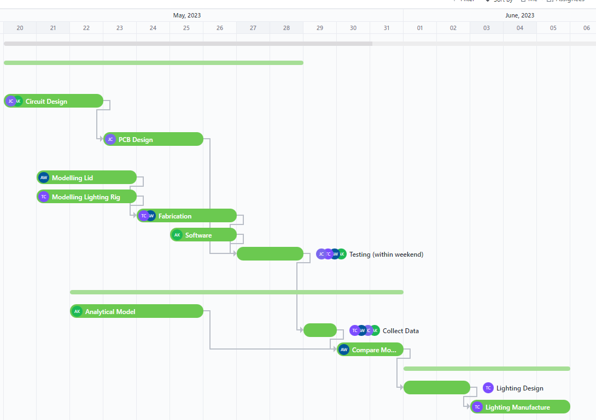
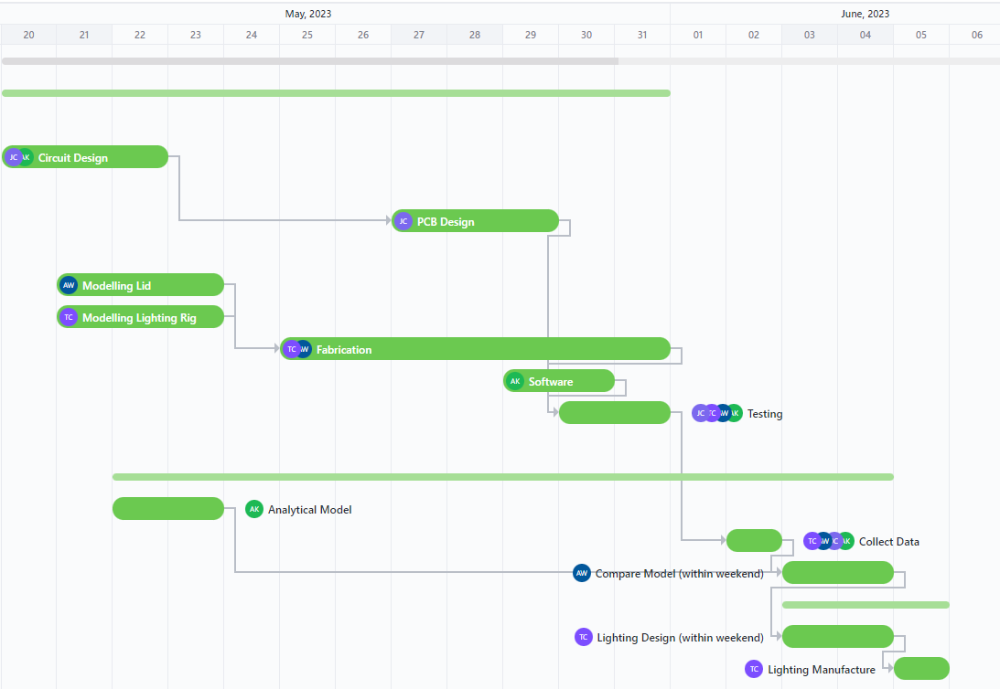

# Project Management

## Gantt chart
To organise the project, [ClickUp](https://clickup.com/) - a project management tool - was used. This had several advantages. Tasks could be assigned to individual people. The progress of the project could be monitored centrally, and deadlines and dependencies were clear.

The Gantt chart provided a lot of value, not only to schedule tasks and monitor project progress, but also to organise dependencies and consider tasks that were blocking others.

The images below show a comparison of the initial Gantt chart plan, with the final actual chart being shown below.

The key differences are as follows (also see [Setbacks](#setbacks)):
- Electronics were highly delayed due to delays in component delivery
- 3D printing of parts took longer than expected due to redesigns and print issues
- Due to electronics being delayed, the final testing and prototyping was also delayed till quite late.
- This delay in testing and prototyping also delayed the collecting and analysis of data.
- This meant there was not enough data to inform the design of the final lighting design, so this was also delayed.
- The analytical model was abandoned, and a discrete computational model used instead, which took significantly less time to implement.

## Task distribution

A challenging aspect of the project was allocating tasks to the most suitable team member. This had to take into account how comfortable each team member was with each task, how much they wanted to do it and how much work they would be doing at the same time.

Verbal discussions were useful in ascertaining what each task would require and which team members would be suitable.

ClickUp was useful for to keep track of what each team member's current tasks were in a centralised system. This allowed tasks to be distributed evenly and avoided overloading any one person.

## Design reviews

A very useful part of the design process was collaborative design reviews of each other's work. These found issues with designs and potential design improvements across mechanical, electrical and software design tasks. 

Design reviews were informally scheduled at the end of each task. While these reviews were helpful, additional design reviews during each task would have prevented the occasional complete redesign which set the project back.

## Setbacks

The following are a few setbacks the team encountered, and ways that they could be avoided in future:

##### Delivery delays leading to a reduction in scope and delay in fabrication:

There was a considerable delay in delivery of multiplexers, which had to be re-ordered. This meant that the circuitry was limited to a maximum of 8 photodiodes. Data was desperately needed, so testing progressed with 8 photodiodes instead of 24. 

The delays due to external factors, but more could have been done to reduce their impact. Extra contingency time could have been planned in to allow lee-way for delivery. Component ordering could have been carried out sooner, before the circuit design was finalised but when the general concept had been decided on.

##### Redesigns leading to delays in manufacturing:

Some components had to be redesigned several times due to their strict dimensional requirements. The design-manufacturing process had an iteration time of about a day, so each design iteration caused significant delay. 

To mitigate this, one could use more careful design process from the outset to reduce the number of design iterations. If this is not feasible, reducing the time per design iteration by using quicker manufacturing methods would also work.

##### 3D printing issues leading to delays in manufacturing:

Several setbacks occurred when 3D printing, including printers running out of filament, abandoning or ruining prints halfway through printing, and a shortage of usable printers. 
Since the electronics were more delayed than the physical components of the testing rig, these issues didn't have much of an impact on the trajectory of the project. However, steps could be taken to mitigate such delays in the future.
Attempting to salvage ruined prints rather than reprinting was an approach that worked occasionally, but could still be explored further.

##### Infeasability of analytical model

Initially, the team was working towards a closed form analytical model for light distribution in a bioreactor. However, it quickly became apparent that this was not a simple task. After several failed attempts at a model, the exact design requirements were re-considered and a computational approximation was deemed suitable. This proved easier to implement and more flexible overall.

## Failure analysis of electronics

The largest failure of the project was the failure of the final stripboard circuit with 24 photodiodes. This prevented the team from gathering further data which would have proved invaluable in further assessing the model and designing the lighting rig. 

A post mortem analysis of this failure presents some things that should have been done differently to avoid such a failure in the future.

The root cause of the failure is hypothesised to be a faulty Arduino. The Arduino stopped working after placing the exposed copper traces of the stripboard circuit on a conductive surface, likely shorting some pins. The chain of reasons that led up to this single failure point can be further deconstructed: 

1. Components ordered late
2. Component delivery delays make prototyping infeasible
3. PCB deemed too risky without prototyping circuitry first
4. Circuitry prototyped on stripboard
5. Stripboard placed on conductive surface
6. Arduino dies
7. Not enough time for replacement due to delays
8. Testing cannot take place as planned.

If any one of those factors had not happened, it is unlikely the same failure would have occurred. The easiest reason above to rectify in hindsight would be to order components earlier, allowing more time for delays. 

The Arduino was also the only component for which spares were not bought, due to its higher price. Buying spares would have meant a drop in replacement would have been usable. 

Having a PCB manufactured, regardless of confidence, might have still been beneficial. The design had been completed, so nothing would have been lost by ordering one. If the PCB had worked, a stripboard would have not been necessary and the circuit would have been more robust. If the PCB had not worked, nothing would have been lost.
