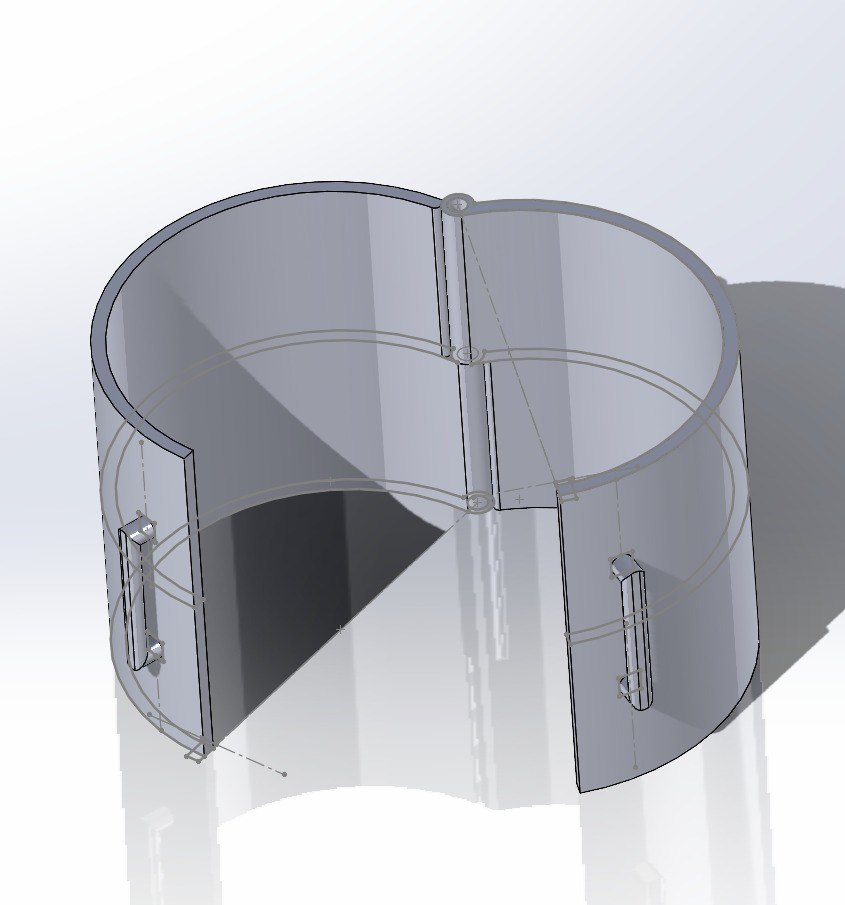
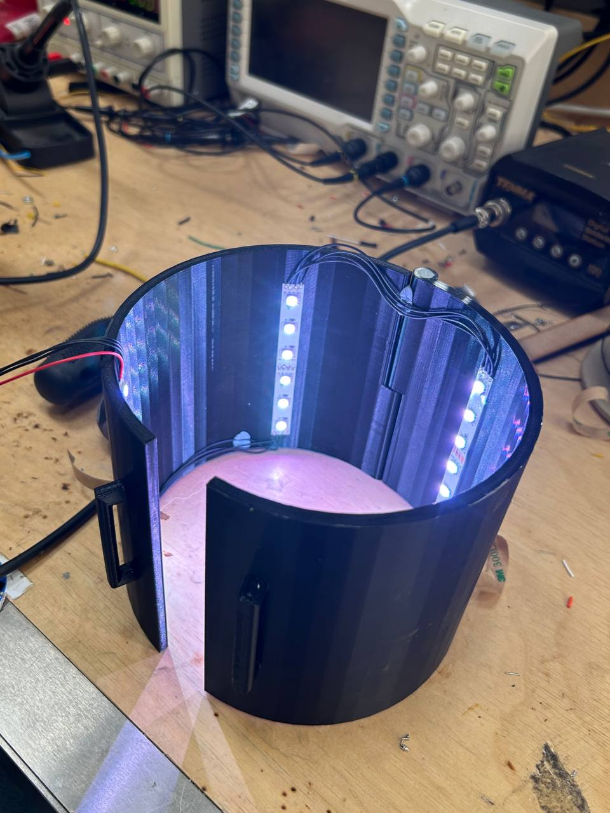

# Lighting Rig Documentation

Author: Tse En Chia

## Description
---

This folder contains all the files for the design and printing of the lighting rig.

For file description and design specifications, see [CAD Files and Design Specifications](#cad-files-and-design-specifications)

## Lighting Rig Design Information
---

In the design process of the final lighting rig, a few main requirements had to be met.

1. Adequately Light

    The lighting rig should be light enough for easy transportation and set up. Users may also choose to take measurements during the synthesis process, thus the rig should be light enough to ensure ease in removing and setting it up again.

2. Low Cost

    The premise of the project was to target users in “the poorest billion”, or specifically to be deployed in Cameroon and Kenya. The cost of our design should therefore be kept as low as possible.

3. Easily Accessible

    Our partner mentioned that in previous trials, there was difficulty in accessing and installing the LED strips within the shell of the rig. Should any maintenance be required, users would also have to access the interior of the rig.

4. Easily Modifiable

    Users who wish to adopt this method of optogenetic induction would also have varying bioreactor specifications depending on their use case. Heating jackets and water jackets may be used, and users may have different volumes of bacteria and sizes of bioreactors, all of which would affect the size of the lighting rig required. The designed rig should therefore be easily customizable for users. 

## Lighting Rig Design
---

The final design of the lighting rig is as shown in the image below. This can be viewed in the assembly file.

The rig uses a 6.35mm diameter rod to act as a pin for the hinge, with two halves that open to allow users to access the interior. Detailed information on the specifications can be found below in [CAD Files and Design Specifications](#cad-files-and-design-specifications).

The two halves of the rig have been designed to be secured by Velcro strips, wrapped around the handles. Users may replace this with material they deem fit to hold the halves together should a Velcro strips be unavailable (e.g. using a string to tie a knot).
  
## LED Arrangement
---

The recommended LED arrangement would be as shown in the diagram below.

  
Four LED strips were installed vertically with equal spacing in the interior of the rig. The reason for this design would be because there is approximately an equal intensity of light for an arc length of about 140 degrees opposite to where the light originates from. This is supported by data collected from our tests which can be found [here](https://github.com/ArnavKoshy/GM2-OptogeneticControl/tree/main/Testing%20Rig).
  
Adding more LED strips would lead to a higher rate of bacteria synthesis but would require more electrical energy to power, which is undesirable for our target users. The recommended design saves about 80% the amount of electrical energy as compared to covering the interior with LEDs. We **do not recommend** using lesser LED strips as this would lead to some parts of the bioreactor not being illuminated.
  
It is also recommended to cover the interior of the rig with a reflective surface (e.g. aluminium foil) to maximise the intensity of light being shone into the bioreactor.

## CAD Files and Design Specifications
---

  The CAD files are as follows:

- `hinge_tube_right.SLDPRT`

  The half of the rig that contains the lower knuckle (or “hinge joint”) of the hinge. The bottom of the knuckle is sealed to prevent the rod from falling out.

- `hinge_tube_left.SLDPRT`

  The half of the rig that contains the upper knuckle of the hinge. The hole of the knuckle goes all the way through for the rod to be inserted. To further secure the rod, blutack can be used to seal the top, although not necessary.

- `prototype.SLDASM`

  Contains the assembly of the lighting rig. Can be used to view the full model.

For ease of modifying the size of the structure, both files have the following global variables. Changing the values of the variables will easily change the dimensions of the structure.
  
- `DIAMETER`

  Inner diameter of the structure. Remember to cater for the height of the LEDs to be installed, and any other equipment to be placed between the jar and the rig (e.g. water jackets). The diameter set in the design file is 140mm given a bioreactor diameter of approximately 125mm.

- `ROD_DIAMETER`

  Diameter of the rod used as the hinge pin. Set a buffer of 0.5mm-1mm depending on the print accuracy. The ROD_DIAMETER in the design file was set to 7mm, given that a steel rod with a diameter of 6.35mm was used.

- `HEIGHT`

  Desired height of the structure. The height in the design file was set to 130mm.
