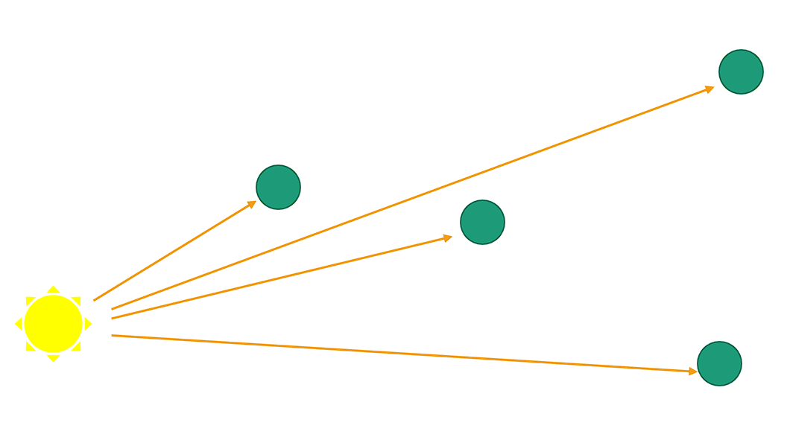
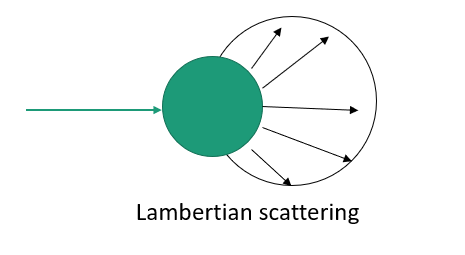
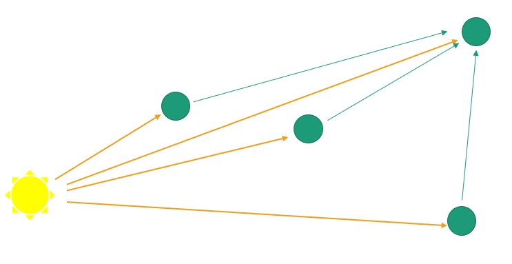

# Modelling documentation
Author: Arnav

## Description
---

This folder contains the files necessary to run a numerical discretized light simulation model. **This model is not accurate, see [Limitations](#limitations)**.

For an overview of how the model works, see [How it works](#how-it-works).

## File descriptions
`main.py` contains the primary code which carries out a simulation of a cross section of a circular bioreactor with a single point source of light.

`benchmark.py` carries out a simulation similar to that in Figure 5. of [this paper](https://www.spiedigitallibrary.org/journals/journal-of-biomedical-optics/volume-19/issue-04/045003/Monte-Carlo-simulation-of-light-transport-in-turbid-medium-with/10.1117/1.JBO.19.4.045003.full?SSO=1&tab=ArticleLinkFigureTable) in order to compare results.

`main3D.py` offers an example of how the simulation could be extended to 3 dimensions if vertical light propagation was also of interest. 

## Instructions to run
---

### Requirements:
    - Python 3.10 or later
    - Python pip
    
### Instructions for setup

Install necessary modules with `pip install -r requirements.txt`

Then run `python main.py`

## How it works
---

The model works by splitting the area of the bioreactor into a set of randomly positioned discrete points. 
These points each act as pockets of fluid, both scattering and attenuating the light that passes through them.

### Attenuation
The attenuation of light passing through the medium is modelled using the [Beer-Lambert law](https://en.wikipedia.org/wiki/Beer%E2%80%93Lambert_law): $I = I_0 e^{-\mu l}$ where $l$ is the distance travelled by a light ray, and $\mu$ is the absorption coefficient of the fluid. This attenuation coefficient can be modified to take into account different attenuations of different wavelengths. **This model of attenuation is wrong, see [Limitations - attenuation](#limitations-of-attenuation)**.

The rays of light created by the source (shown in orange in the figure below) are assumed to pass through turbid fluid on the way to each point, attenuating with the Beer-Lambert Law.

The Beer-Lambert law only considers light travelling in a straight line, and does not consider the scattering of light due to the fluid, and this has to be taken into account separately.

### Scattering
Scattering is considered by a phenomenon known as [Lambertian cosine law](https://www.sciencedirect.com/science/article/pii/B9780123860224000066), which describes the behaviour of light as it passes through a diffuse medium. The intensity of light varies with the cosine of the angle to the incident ray, as shown in the figure below. This is not the only scattering model, as discussed in [Limitations - scattering](#limitations-of-scattering)

Scattered light from each point is also attenuated as it progresses to every other point in the model, as shown by the green arrows. The final intensity is the sum of the direct light from the point source and scattered light from every other point.

## Limitations

### Magnitudes and units
###### The issue:
The model does not consider exact magnitudes and units of light, and should at this stage be only used as an approximation for spatial light distribution within a turbid vessel.

###### How to fix:
Addition of units might involve specifying the power of the light source and then calculating incident power at each discrete point, taking into account attenuation.

### Limitations of Attenuation

###### The issue:
The attenuation equation used in the model is incorrect. It does not take into account the inverse square law attenuation of the light from the point light source. 

This means that the radial distribution of the light from the point source is incorrect. However this should not have much effect on the overall shape of the graph of circumferential light intensity, but rather drastically decrease the magnitude.

###### How to fix:
Fixing this would firstly involve implementing the inverse square law attenuation in the attenuation function (`LightModel.py line 20`) for both direct illumination from the light source and scattered light.

To prevent numerical instabilities due to very closely spaced points, it could be beneficial to move away from randomly positioned points and towards a more uniform distribution such as a grid or Poisson disc sampling.

### Limitations of scattering
###### The issue:
The scattering model used assumes perfect diffusion of incident light with the Lambert cosine law. In reality, the distribution of scattered light may look more like [Mie scattering](https://en.wikipedia.org/wiki/Mie_scattering) or similar. The amount of scattered light is assumed to be proportional to the characteristic dimension of each pocket of fluid, which may not be valid.

###### How to fix:
The scattering function can be changed to better reflect a more realistic scattering distribution. An angle variable has been included to be passed to a custom function in `LightModel.py line 75`

### Limitations of light source
###### The issue:
The light source is modelled as having a light intensity that varies with the cosine of the angle from its forward direction. This is a good approximation of the LEDs used for the testing rig, but may not be representative of your lighting.

###### How to fix:
`LightModel.py line 40` exposes an angle variable that can be passed into a custom function that returns a light distribution factor describing the spread of light from a light source.

### Computational speed
###### The issue:
The software is written in Python and not well-optimised, so the simulation is quite slow. Additionally, there are no approximations used to speed up the computation, so the simulation is $O(n^2)$ complexity, which makes it very slow for large numbers of points.

###### How to fix:
One solution would be to port the code to a different more performant language, such as C++. Otherwise, speed ups could be implemented in Python by using faster algorithms for the spatial computation, potentially by ignoring far away points or considering them in groups using something like [Barnes-Hut](https://jheer.github.io/barnes-hut/) adapted for light intensity rather than forces.

