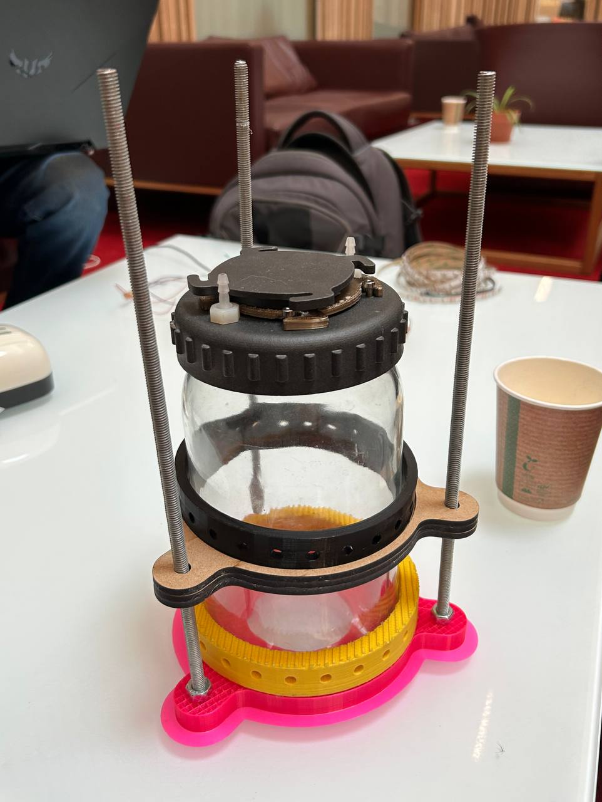

# Physical Rig Documentation
---
Author: Tse En Chia

## Description
---
This folder contains all the files for the design and printing of the testing rig.

For file description and design specifications, see [CAD Files and Design Specifications](#cad-files-and-design-specifications)

## Testing Rig Design Infomation
---

In the design process of the physical testing rig, a few main requirements had to be met.

1.	Able to measure light distribution circumferentially around the bioreactor
2.	Adjustable height

Research done by our partner, Dr. Jenny Molloy, yielded [Kitchener et al. (2019)]( https://www.hardware-x.com/article/S2468-0672(18)30076-2/fulltext) who developed a sensor ring around a cylinder for turbidity measurement. By taking their model as reference, we then designed a testing rig suitable for our measurements.

## Testing Rig Design
---

The final design of the testing rig can be shown in the diagram below.

## CAD Files and Design Specifications
---

Using a bioreactor jar of diameter 125.5mm, the CAD files are as follows:

-	`base.SLDPRT`

  The base of the testing rig. It comes to a height of 25mm and has an internal diameter of 125.5mm. Do set a diameter slightly smaller or exactly the size of the bioreactor and file the interior to get the jar to fit perfectly. The three threaded holes are for M8 rods.
  
-	`sensor_ring.SLDPRT`

  The ring where sensors are fixed in place for measurement. This should lie on top of the sensor collar. We worked with sensors with a diameter of 5.8mm, and the sensor holes were set to 6mm. The diameter of the sensor ring was set to 126mm.

-	`sensor_collar.SLDPRT`

  The piece which controls the height of the sensors, by resting on nuts screwed into the threaded rod. The sensor ring should fit on top of this part. The diameter of the sensor collar need not be too close to the bioreactor, and has been set to 128mm. The diameter of the holes which the threaded rod passes through has been set to 8.2mm.
  
## References
---
  
Kitchener, Ben GB, et al. "A low-cost bench-top research device for turbidity measurement by radially distributed illumination intensity sensing at multiple wavelengths." HardwareX 5 (2019): e00052.
https://www.hardware-x.com/article/S2468-0672(18)30076-2/fulltext
